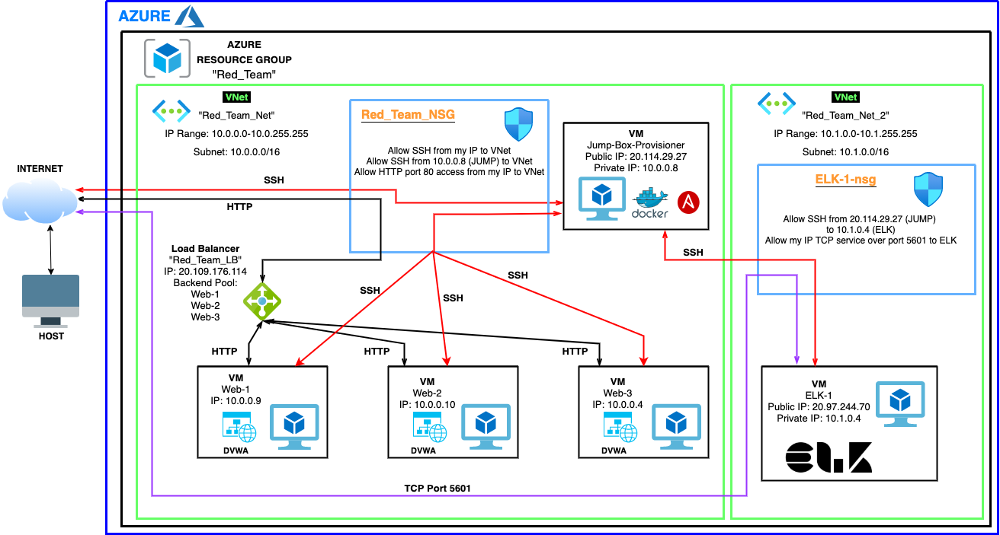
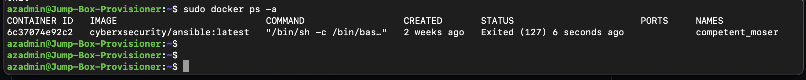

## Automated ELK Stack Deployment

The files in this repository were used to configure the network depicted below.

These files have been tested and used to generate a live ELK deployment on Azure. They can be used to either recreate the entire deployment pictured above. Alternatively, select portions of the **Ansible** file may be used to install only certain pieces of it, such as Filebeat.

  

This document contains the following details:
- Description of the Topology
- Access Policies
- ELK Configuration
  - Beats in Use
  - Machines Being Monitored
- How to Use the Ansible Build

### Description of the Topology

The main purpose of this network is to expose a load-balanced and monitored instance of DVWA, the D*mn Vulnerable Web Application.

Load balancing ensures that the application will be highly available, in addition to restricting unwanted access to the network.

Integrating an ELK server allows users to easily monitor the vulnerable VMs for changes to the *System Logs* and *System Metrics*.

The configuration details of each machine may be found below.

| Name                 | Function      | IP Address     | Operating System |
|----------------------|---------------|----------------|------------------|
| Jump-Box-Provisioner | Gateway       | 20.114.29.27   | Linux            |
| Web-1                | DVWA Server   | 10.0.0.9       | Linux            |
| Web-2                | DVWA Server   | 10.0.0.10      | Linux            |
| Web-3                | DVWA Server   | 10.0.0.4       | Linux            |
| ELK-1                | ELK Server    | 10.1.0.4       | Linux            |
| Red_Team_LB          | Load Balancer | 20.109.176.114 | N/A              |

### Access Policies

The machines on the internal network are not exposed to the public Internet. 

Only the **Jump-Box-Provisioner** machine can accept connections from the Internet. Access to this machine is only allowed from the following IP addresses:
- **99.51.241.50**

Machines within the network can only be accessed by **Jump-Box-Provisioner/10.0.0.8**

A summary of the access policies in place can be found in the table below.

| Name                 | Publicly Accessible | Allowed IP Addresses |
|----------------------|---------------------|----------------------|
| Jump-Box-Provisioner | Yes                 | 99.51.241.50         |
| Web-1                | No                  | 10.0.0.8             |
| Web-2                | No                  | 10.0.0.8             |
| Web-3                | No                  | 10.0.0.8             |
| ELK-1                | No                  | 10.0.0.8             |
| Red_Team_LB          | Yes                 | 99.51.241.50         |

### Elk Configuration

Ansible was used to automate configuration of the ELK machine. No configuration was performed manually, which is advantageous because I was able to download and install Docker, ready the system's memory, pull the ELK docker image, and set the system to start Docker on boot all in one fell swoop. Also this ensures the ELK container is running every time I boot up the ELK machine saving me from manually launching each time.

The playbook implements the following tasks:
- Download Docker
- Install Python (needed to run Docker)
- Install Docker w/ Python
- Set system memory
- Download and launch ELK container image
- Enable Docker on boot

The following screenshot displays the result of running `docker ps` after successfully configuring the ELK instance.

### Target Machines & Beats
This ELK server is configured to monitor the following machines:
- **Web-1/10.0.0.9**
- **Web-2/10.0.0.10**
- **Web-3/10.0.0.4**

We have installed the following Beats on these machines:
- **FileBeat**
- **MetricBeat**

These Beats allow us to collect the following information from each machine:
- FileBeat allows us to see and filter all the system logs, including but not limited to auth.log, syslog, etc. MetricBeat allows us to see and measure system health by looking at CPU usage, Memory usage, and Inbound/Outbound traffic.

### Using the Playbook
In order to use the playbook, you will need to have an Ansible control node already configured. Assuming you have such a control node provisioned: 

SSH into the control node and follow the steps below:
- Copy the **filebeat-playbook.yml, metricbeat-playbook.yml, elk-playbook.yml** to **/etc/ansible** inside our Ansible container.
- Update the **hosts** file to include the IP addresses of our Webservers that will be receiving FileBeat/MetricBeat and the IP address of our ELK machine that will be receiving the ELK container.
- Run the playbook, and navigate to http://20.97.244.70/app/kibana to check that the installation worked as expected.
